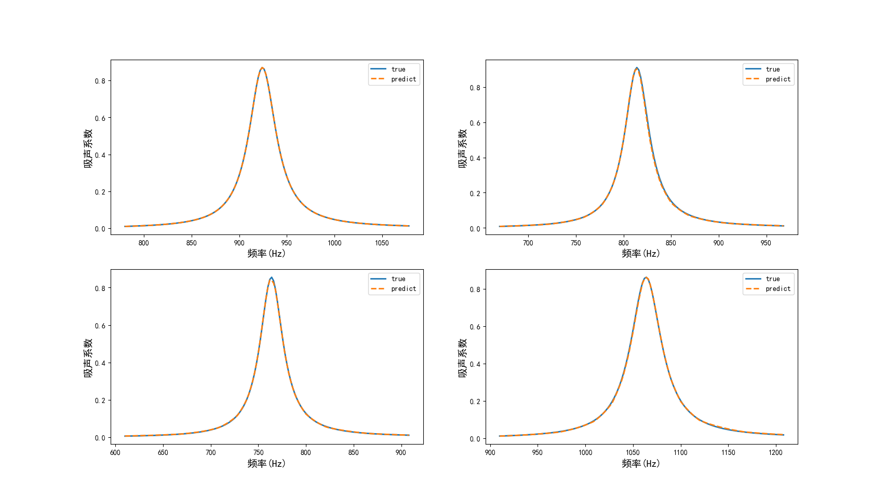

# Machine-Learning-Driven Design of Labyrinthine Ventilated Sound Absorbers

[](https://doi.org/10.1088/1361-665X/ae5b03)
[](https://www.python.org/)
[](https://www.comsol.com/)
[](LICENSE)

[中文说明](README.zh-CN.md)

Research code, sample data, trained checkpoints, and validation results for the paper:

> W. Li, L. Yan, J. Lin, T. Yang, R. Bi, and B. Xia, "Design of labyrinthine ventilated sound absorption structures driven by machine learning," *Smart Materials and Structures*, vol. 35, no. 4, 045035, 2026. https://doi.org/10.1088/1361-665X/ae5b03

The repository was assembled from the master's thesis research of Longhui Yan at Hunan University. It covers theoretical impedance modeling, parameter sampling and sensitivity analysis, forward surrogate models, function-driven and geometry-driven inverse networks, and particle swarm optimization (PSO). It is a curated research archive with partial reproducibility; the full FEM-to-training workflow still requires external data and licensed COMSOL software.



## Research Scope

The workflow combines:

1. A theoretical impedance model and COMSOL finite-element simulations of a labyrinthine ventilated sound-absorbing disc.
2. Latin hypercube sampling (LHS), Sobol analysis, and random-forest feature importance.
3. LightGBM and convolutional neural network surrogate models for forward prediction.
4. A functional design network and an inverse design network for mapping performance requirements to absorption curves and structural parameters.
5. PSO-based peak-frequency tuning and broadband coupling optimization.

The thesis validation reports absorption coefficients above 0.8 from 935 to 1110 Hz, with an average coefficient of approximately 0.89. Within that interval, a 78 Hz band exceeds 0.9 with an average coefficient of approximately 0.93. The journal article abstract reports absorption above 0.85 across its target band and validation by simulation and experiment.

## Repository Layout

```text
.
|-- research_code/
|   |-- theory_and_sensitivity/       # Chapter 2 models and sensitivity analyses
|   |-- forward_design/               # Sampling and LightGBM/CNN surrogate models
|   |-- inverse_design/
|   |   |-- preprocessing/             # Dataset assembly and COMSOL extraction
|   |   |-- functional_network/        # Function requirement -> absorption response
|   |   `-- geometry_network/          # Absorption response -> geometry
|   `-- legacy/                        # Historical model-comparison baselines
|-- data/
|   |-- samples/                       # Small, GitHub-friendly example datasets
|   `-- validation/                    # Selected COMSOL and PSO validation curves
|-- artifacts/checkpoints/             # Original PyTorch and LightGBM checkpoints
|-- results/figures/                    # Representative figures from the study
|-- examples/                           # Portable entry points
|-- docs/                               # Code map, data policy, and reproduction notes
`-- tools/verify_repository.py          # Standard-library repository checks
```

The original experiment scripts are retained to preserve provenance. Some of them contain historical absolute paths and expect files that are too large for normal GitHub storage. See [Reproducibility Notes](docs/REPRODUCIBILITY.md) before running those scripts.

The curation boundaries and excluded draft/tutorial files are recorded in [Curation Exclusions](docs/EXCLUSIONS.md); the parent thesis workspace was not modified.

## Environment

The recommended compatibility environment is:

- Python 3.10.13
- NumPy 1.24.4 (`numpy<2` is required by calls to `ndarray.ptp` and `np.Inf`)
- PyTorch 2.0.1
- scikit-learn 1.3.0
- LightGBM 4.0.0
- SALib 1.4.7
- COMSOL Multiphysics 6.0.0.318 with Acoustics, CAD Import, and Design products for FEM regeneration

Create the environment with Conda:

```bash
conda env create -f environment.yml
conda activate labyrinth-absorber-ml
```

Or use Python 3.10 and pip:

```bash
python -m venv .venv
# Windows: .venv\Scripts\activate
# Linux/macOS: source .venv/bin/activate
python -m pip install --upgrade pip
python -m pip install -r requirements.txt
```

GPU acceleration is optional. The historical scripts select CUDA device 0 when it is available and otherwise use the CPU.

The version pins reconstruct a conservative compatibility environment from the saved Python 3.10.13 notebook metadata and the APIs used by the code. They are not an exported package list from the original machine; for archival-grade replication, record a solved lock file after validating the full external dataset.

## Quick Start

Run the portable theoretical-model example:

```bash
python examples/run_theoretical_model.py --output results/generated/theoretical-absorption.png
```

The numerical CSV is always written. The PNG is written when Matplotlib is installed, as it is in the pinned environment.

Audit the repository without importing any scientific dependencies:

```bash
python tools/verify_repository.py --strict
```

Inspect the notebook used for the forward CNN experiment:

```bash
jupyter lab research_code/forward_design/3.3CNN_0.9988.ipynb
```

For the complete FEM-to-optimization workflow, restore the external data listed in [Data and Large Files](docs/DATASETS.md), update paths in a local working copy, and follow [Reproducibility Notes](docs/REPRODUCIBILITY.md).

## Reproducibility Status

| Level | Included | Status |
|---|---|---|
| Theory demo | Impedance model and portable runner | Runnable after Python dependencies are installed |
| Data inspection | LHS samples, small COMSOL exports, validation curves, figures | Included |
| Model inspection | PyTorch checkpoints and LightGBM pickle | Byte-verified archive; several architecture/filename mappings remain unresolved |
| Full neural-network retraining | Large generated training matrices | Not included in Git history |
| FEM regeneration | 868 MiB COMSOL model and licensed modules | External artifact required |

This is a curated research archive, not a production Python package. The quality workflow verifies repository structure, selected data shapes, artifact hashes, relative documentation links, and Python syntax; it does not claim that every historical experiment script runs end-to-end without restoring its original external data.

## Data and Model Safety

- GitHub rejects normal uploads above 100 MiB. The full COMSOL model and several training matrices are therefore documented by size and SHA-256 hash rather than copied here.
- Publish large research artifacts through Zenodo, an institutional repository, or Git LFS, then record the permanent URL and checksum in `docs/DATASETS.md`.
- `*.pkl` and `*.pth` files are serialized artifacts. Load only the files distributed with this repository and never load untrusted replacements.
- Manuscripts, thesis files, review materials, IDE settings, cache files, MNIST, and third-party code are intentionally excluded.

## Citation

GitHub can read [CITATION.cff](CITATION.cff) directly. A BibTeX record is also provided in [CITATION.bib](CITATION.bib).

```bibtex
@article{Li2026Labyrinthine,
  author  = {Li, Weike and Yan, Longhui and Lin, Jianhua and Yang, Tao and Bi, Rengui and Xia, Baizhan},
  title   = {Design of labyrinthine ventilated sound absorption structures driven by machine learning},
  journal = {Smart Materials and Structures},
  volume  = {35},
  number  = {4},
  pages   = {045035},
  year    = {2026},
  doi     = {10.1088/1361-665X/ae5b03}
}
```

## License

No open-source license has been granted yet. The current [LICENSE](LICENSE) reserves all rights while code ownership and co-author/institutional permissions are confirmed. Replace it with an approved open-source license before inviting reuse or contributions.

## Repository Setup

The recommended GitHub repository name is **`labyrinthine-ventilated-absorber-ml`**. Suggested description, topics, release steps, and push commands are in [GitHub Setup](docs/GITHUB_SETUP.md).
